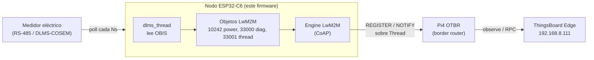
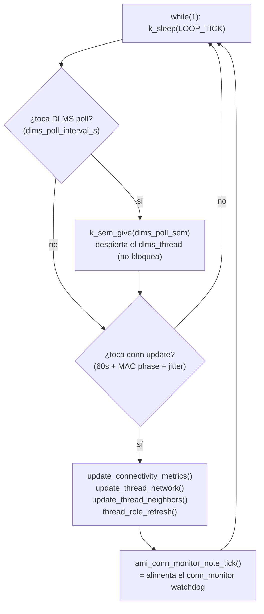
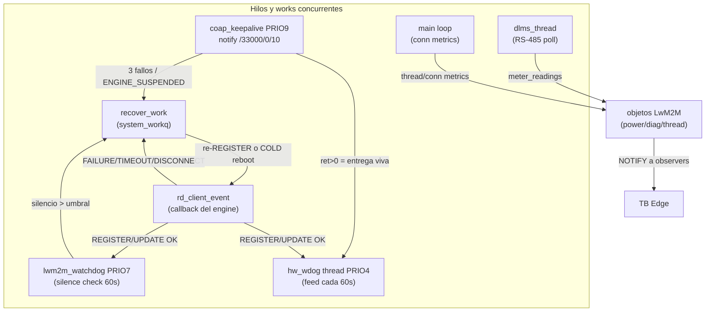
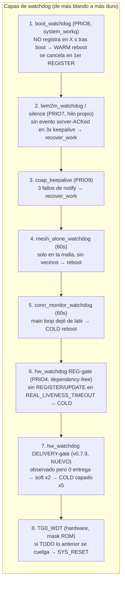
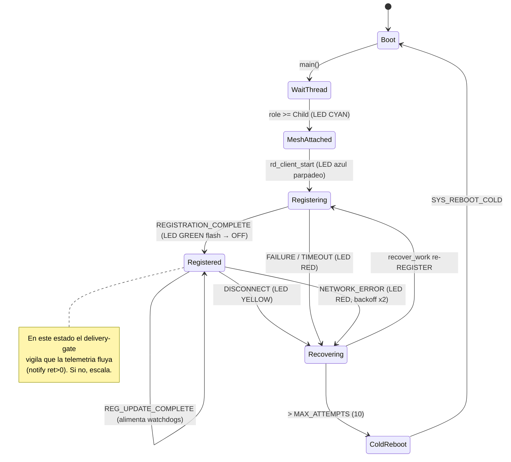
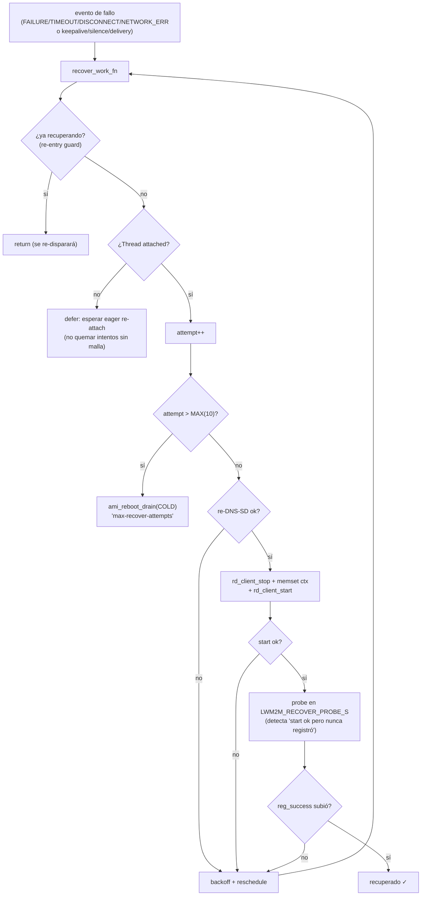
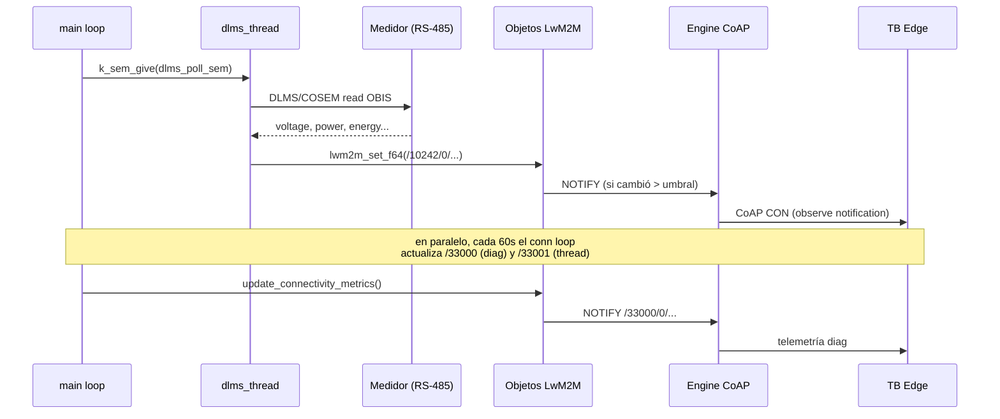
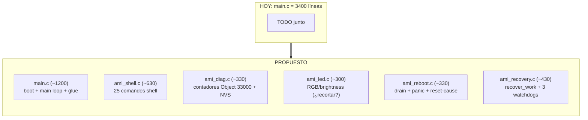

# Arquitectura de `main.c` — guía visual para entender qué hace el código

> Objetivo: entender el flujo del firmware AMI antes de decidir qué optimizar.
> Todos los diagramas son Mermaid (se renderizan en VSCode / GitHub).

`main.c` (3400 líneas) mezcla 8 subsistemas. Esta guía los separa visualmente.

---

## 0. Vista de 10.000 pies — ¿qué es este firmware?

Un nodo AMI: lee un **medidor eléctrico** por RS-485/DLMS, se une a una **malla Thread**,
y publica la telemetría a **ThingsBoard Edge** vía **LwM2M** (CoAP). Todo lo demás
(watchdogs, recovery, LED, shell, diag) existe para que eso **no se caiga** en una
flota de 30 nodos.

---

## 1. Secuencia de boot — `main()` paso a paso

Lo más importante: **el orden de arranque es deliberado**. Cada capa de defensa
(watchdog) se arma ANTES de la operación riesgosa que protege.

```mermaid
flowchart TD
    PK["SYS_INIT @POST_KERNEL<br/>hw_watchdog_boot_arm()<br/>arma chan_boot SIN alimentar"] --> M0["main() entry"]
    M0 --> C1["ami_reboot_capture_boot_code()<br/>latch RID37 = por qué rebooteó este boot"]
    C1 --> ST["BOOT STAGGER<br/>sleep 0..30s aleatorio<br/>(evita que N boards re-arranquen sincronizados)"]
    ST --> SET["settings_subsys_init()<br/>load NVS: ami/* + pm/*"]
    SET --> RR["capture_reset_reason()<br/>persiste total_resets (RID22)"]
    RR --> BB{"boot_burst >= MAX?<br/>(crash-loop?)"}
    BB -- "sí" --> THR["throttle: sleep largo<br/>(protege NVS de wear + ventana p/ intervenir)"]
    BB -- "no" --> INC["inc boot_burst"]
    THR --> INC
    INC --> PM["publica post-mortem<br/>del boot ANTERIOR (RIDs 23-28)"]
    PM --> HW["hw_watchdog_init()<br/>PRIO9: chan_kernel + chan_workq"]
    HW --> SURV["hw_watchdog_note_boot_survived()<br/>alimenta chan_boot = 'pasé la zona NVS'"]
    SURV --> BW["boot_watchdog ARM<br/>PRIO8: deadline a 1er REGISTER"]
    BW --> DS["apply_otbr_dataset()<br/>TLV: prefijo mesh + PSKc + canal 25"]
    DS --> CB["registra thread_state_changed_cb"]
    CB --> POLL{"poll role hasta<br/>Child/Router/Leader<br/>(max 120 x 2s)"}
    POLL -- "attached" --> IPV6["LED CYAN + espera 5s<br/>(propagación IPv6)"]
    IPV6 --> EP["build_endpoint_name()<br/>ami-esp32c6-XXXX desde MAC"]
    EP --> DNS{"lwm2m_discover_with_retry()<br/>DNS-SD x10"}
    DNS -- "falla terminal" --> WR["warm-reboot<br/>(dns-sd-boot-fail)"]
    DNS -- "ok" --> SU["lwm2m_setup()<br/>registra objetos LwM2M"]
    SU --> JIT["REGISTER jitter 0..30s<br/>(anti server-avalanche)"]
    JIT --> RN["reached_network=1<br/>(boot-wd ya NO rebootea: fallo ahora es server-side)"]
    RN --> START["lwm2m_rd_client_start()<br/>arranca REGISTER"]
    START --> W5["lwm2m_watchdog_init() PRIO5"]
    W5 --> KA["coap_keepalive_init() PRIO9"]
    KA --> AW["arma mesh_alone_wdog + conn_monitor_wdog (60s)"]
    AW --> LOOP[["MAIN LOOP (abajo)"]]

    style PK fill:#fde,stroke:#a33
    style HW fill:#fde,stroke:#a33
    style BW fill:#fde,stroke:#a33
    style W5 fill:#fde,stroke:#a33
    style KA fill:#fde,stroke:#a33
    style AW fill:#fde,stroke:#a33
```

> 🔴 Los nodos rojos son **las capas de watchdog** — fijate cómo se arman
> progresivamente a medida que el boot avanza.

---

## 2. El MAIN LOOP — lo que corre para siempre

Sorprendentemente simple: el loop solo **dispara** trabajo, no lo hace él mismo.

> El loop principal late cada `LOOP_TICK`. Si **deja** de latir (se cuelga), el
> `conn_monitor_wdog` lo detecta porque `note_tick()` no se llama → COLD reboot.

---

## 3. Concurrencia — qué corre EN PARALELO después del boot

Esto es lo que más confunde: hay **muchos hilos/works** corriendo a la vez.

> Regla de oro del diseño: **una señal de salud solo cuenta si NO se puede
> falsear con la radio muerta.** Por eso los watchdogs se alimentan de eventos
> *server-ACKed* (REGISTER) y de *entrega real* (notify ret>0), no de
> "puse el dato en la cola".

---

## 4. Defensa en profundidad — los 7 watchdogs (¡esto es clave!)

Hay **siete** capas que pueden rebootear/recuperar el nodo. Cada una cubre un
modo de falla que las otras NO ven.

| # | Watchdog | Qué modo de falla caza | Acción |
|---|---|---|---|
| 1 | boot (PRIO8) | nunca llega al 1er REGISTER | WARM reboot |
| 2 | silence (PRIO7) | engine sin eventos (zombie) | recover_work |
| 3 | keepalive (PRIO9) | socket CoAP muerto | recover_work |
| 4 | mesh-alone | aislado en la malla | reboot |
| 5 | conn-monitor | main loop colgado | COLD reboot |
| 6 | hw REG-gate (PRIO4) | radio/USB wedge, CPU vivo | COLD (dependency-free) |
| 7 | hw DELIVERY-gate | registrado pero sin entregar telemetría | soft→COLD capado |
| 8 | TG0_WDT (HW) | todo lo de software muerto | SYS_RESET |

> **El #7 es el que acabamos de construir** (delivery-liveness gate). Caza
> exactamente el estado de Lab 17: registrado, REG_UPDATE OK, pero observe-session
> muerta → 0 telemetría por horas, sin auto-reboot.

---

## 5. Máquina de estados de la conexión LwM2M (+ colores del LED)

`rd_client_event()` es el corazón del ciclo de vida. Cada evento del engine
mueve el estado y cambia el LED.

**Colores del LED** (señal visual de campo):
| Color | Estado |
|---|---|
| OFF | early boot / idle operando (solo parpadea en cada TX) |
| BLUE (parpadeo) | esperando attach a Thread |
| CYAN | malla attached, esperando IPv6 |
| GREEN (flash) | REGISTER completo → entra a operación |
| YELLOW | desconectado |
| RED | fallo de registro / network error |

> Nota: en producción el LED está **no-op'd** (GPIO8 rompe la radio SPI). Ver
> `project_spi_breaks_thread_radio`. El subsistema LED (~300 líneas) es candidato
> #1 a recortar.

---

## 6. Máquina de recovery — `lwm2m_recover_work_fn()`

Cómo el nodo intenta recuperarse, con backoff y escalación a reboot.

> Detalles finos: backoff **exponencial** + jitter; `NETWORK_ERROR` duplica el
> backoff (storm-backoff); tras MAX escala a **COLD** (no WARM) porque WARM
> preservaba la corrupción de mesh-attach. El `noreg_boots` evita reboot-storms
> en outage de servidor.

---

## 7. Flujo de datos — del medidor a ThingsBoard

---

## 8. Mapa de módulos — propuesta de refactor (split de main.c)

Cómo quedaría si separamos `main.c` en módulos (cero cambio de comportamiento).

**Candidatos a RECORTAR (no solo mover):**
- 🟡 `fill_demo_readings` (~80 líneas): solo bajo `CONFIG_AMI_DEMO_MODE` (off en prod) pero se compila siempre → `#ifdef` o borrar.
- 🟡 `cmd_ami_test_*` (~250 líneas): comandos de test puro dev → gate tras `CONFIG_AMI_TEST_CMDS`.
- 🟡 8 comandos `cmd_ami_log_*` → colapsar en 1 parametrizado.
- 🟡 Subsistema LED (~300 líneas): ya está no-op'd en HW → ¿lo dejamos como stub mínimo?

---

## Resumen para decidir

1. **Entender** (este doc) ✓
2. **Split** (refactor seguro): main.c → 6 módulos, queda en ~1200 líneas.
3. **Trim** (recorte real de flash/RAM): demo + test-cmds + LED, con test.
4. **Lo confuso**: los 7 watchdogs (sección 4) y la recovery (sección 6) son lo
   más denso — empezá por ahí si algo no cierra.
