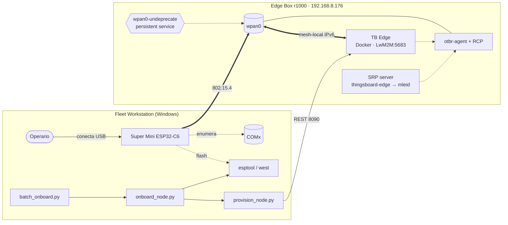
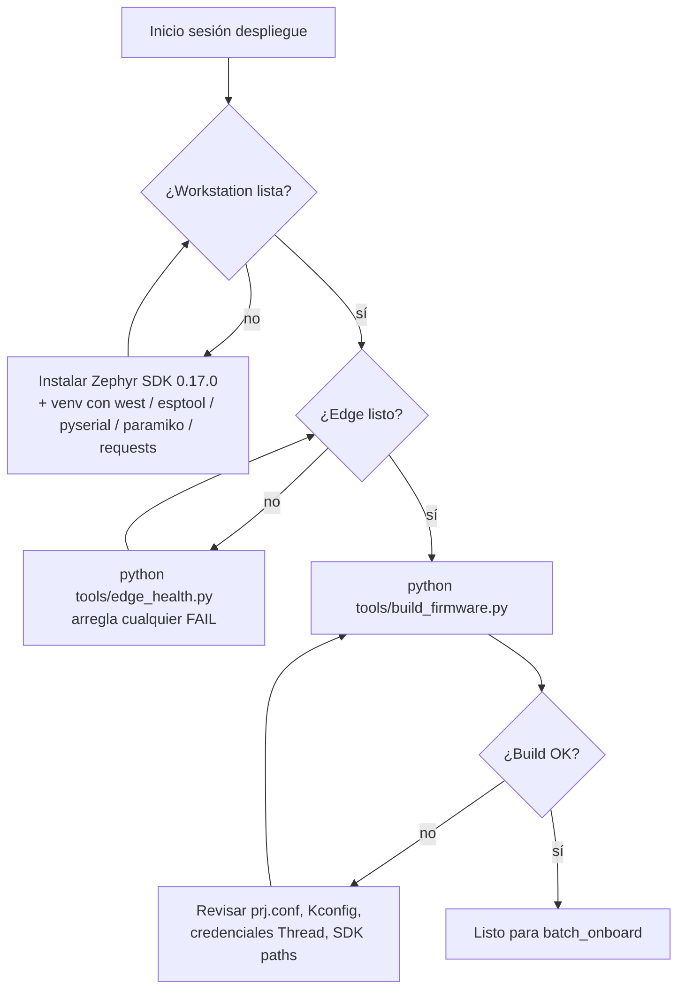
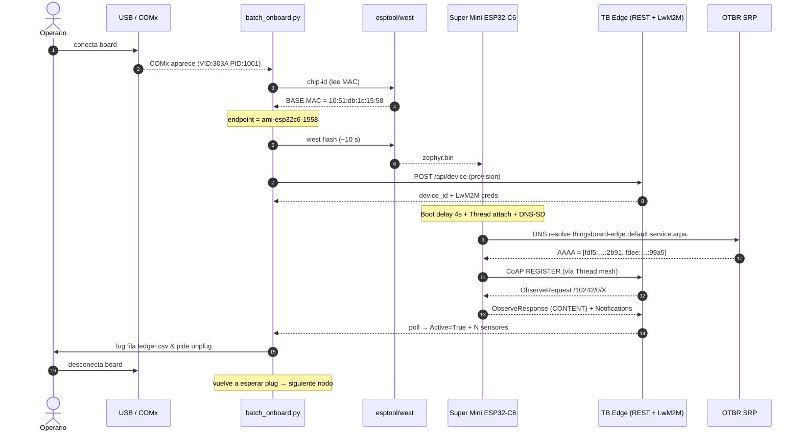
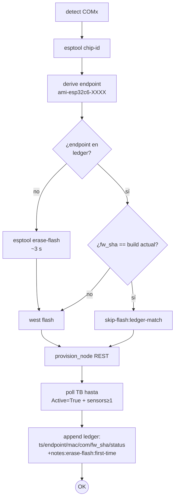
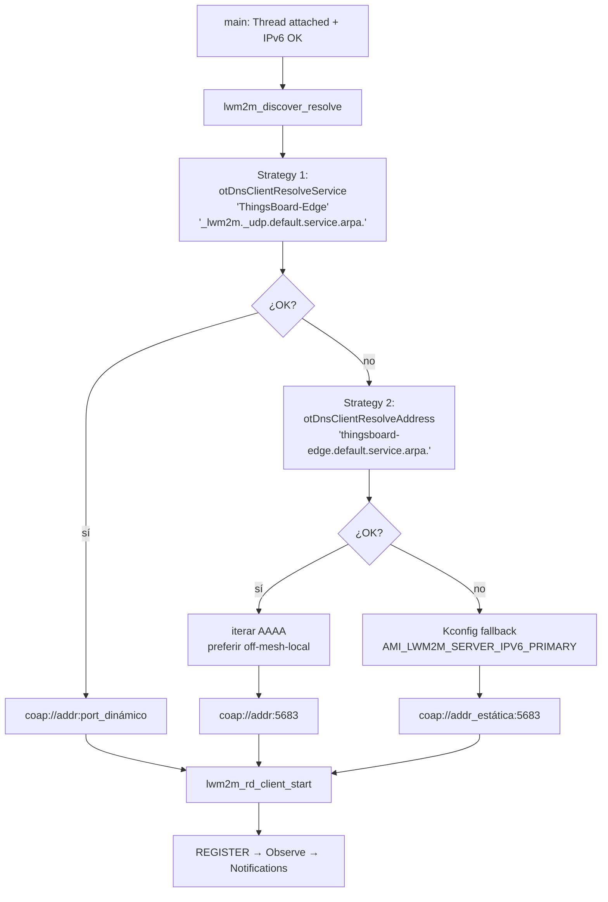
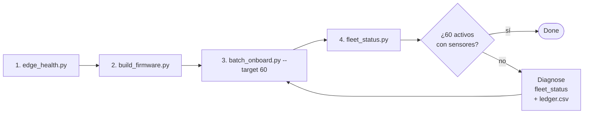
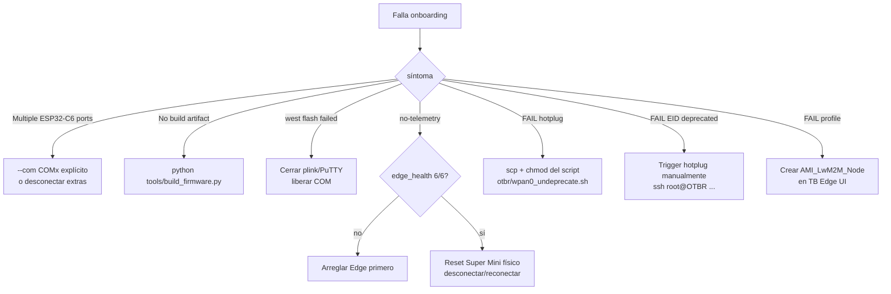
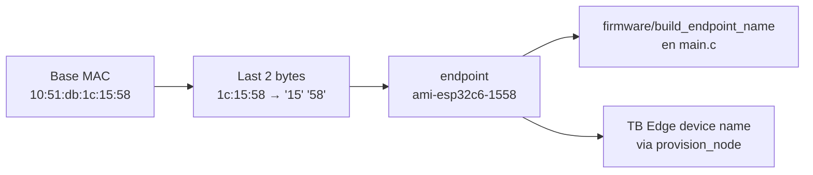

# AMI Node — End-to-End Deployment Procedure

> Walkthrough completo para desplegar 1..N nodos AMI (ESP32-C6 Super Mini) sobre
> Thread + LwM2M + ThingsBoard Edge usando los tools de `tools/`.
>
> **Default de producción**: mesh `r1000` (UNAL-R1000, channel 21,
> Edge `192.168.8.176:8090`). Variant `med` (Minimal End Device).
>
> Mesh `pi4` (legacy UNAL-Thread, `192.168.1.111`) sigue soportada como
> opción `--mesh pi4` para los nodos legacy aún sin migrar.

---

## 0. Variantes de firmware (med / ftd)

Para evitar que cada nodo se promueva a Router (con la sobrecarga de tráfico
mesh que eso conlleva en una flota de 60 nodos), el firmware se compila en dos
variantes seleccionadas vía overlay de Kconfig:

| Variante | Tamaño | Rol Thread | Uso |
|---|---|---|---|
| `med` (default) | ~612 KiB | MTD — Minimal End Device, RxOnWhenIdle=true | Todos los nodos por defecto |
| `ftd` | ~680 KiB | FTD — Router-eligible | Solo los nodos elegidos para actuar como router (~5–10% de la flota) |

Estructura (cada combinación variant × mesh tiene su propio build dir):

```
prj.conf                            # común (sin OPENTHREAD_FTD/MTD/MESH)
overlays/med.conf                   # CONFIG_OPENTHREAD_MTD=y
overlays/ftd.conf                   # CONFIG_OPENTHREAD_FTD=y
overlays/r1000.conf                 # mesh r1000 + lifetime=120s
overlays/pi4.conf                   # mesh pi4 (legacy)
build_med_r1000/zephyr/zephyr.bin   ← default
build_ftd_r1000/zephyr/zephyr.bin
build_med_pi4/zephyr/zephyr.bin     (solo si --mesh pi4)
build_ftd_pi4/zephyr/zephyr.bin
```

```bash
# Compila las dos variantes para la mesh default (r1000)
python tools/build_firmware.py --variant all

# Flashear default (med + r1000) a una board nueva
python tools/onboard_node.py
python tools/onboard_node.py --com COM18

# Flashear ftd a una board específica que quieras como router
python tools/onboard_node.py --com COM18 --variant ftd

# Solo si necesitas migrar/mantener un nodo legacy en pi4:
python tools/onboard_node.py --com COM18 --mesh pi4
```

> **Cambiar de rol implica re-flash**: como `med` y `ftd` son binarios
> distintos (compile-time MTD vs FTD), no hay forma de promover un nodo de
> MED a FTD via CLI. Si decides que cierto nodo debe ser router, basta con
> reflashear ese mismo board con `--variant ftd`. El `onboard_node.py`
> detecta el cambio de variant en el ledger, hace `erase-flash` y reflashea.

El ledger (`tools/deployment_ledger.csv`) guarda la columna `variant` por nodo.

---

## 1. Arquitectura



**Componentes**:
- Fleet workstation: corre los tools Python para flashear, provisionar y verificar.
- Super Mini: cliente Thread end-device + cliente LwM2M.
- OTBR: bridge 802.15.4 ↔ IPv6 + SRP server (DNS-SD).
- TB Edge: server LwM2M (Leshan) + Postgres + sync gRPC con TB Cloud.

---

## 2. Pre-requisitos



### 2.1 Workstation
- Python 3.10+ con `pyserial`, `paramiko`, `requests` (los tools auto-bootstrap al venv si están ahí).
- Zephyr SDK `0.17.0` en `C:\Users\<user>\zephyr-sdk-0.17.0` (auto-detectado).
- west workspace en `Documents/ESP32/zephyrproject` (auto-detectado).

### 2.2 Edge — `tools/edge_health.py` debe pasar 7/7:

```bash
python tools\edge_health.py            # default → mesh r1000
python tools\edge_health.py --mesh pi4  # solo si manejas legacy
```

| Check | Significado |
|---|---|
| tb-edge container | Docker corriendo |
| LwM2M listener `[::]:5683` | Server CoAP escuchando dual-stack v6 |
| SRP server | OpenThread SRP corriendo (DNS-SD) |
| SRP host `thingsboard-edge.…` → mleid | Discovery + simetría src/dst |
| `wpan0-undeprecate` persistente | mesh-local EID con `preferred_lft forever` (servicio/timer/cron en el OTBR) |
| mesh-local EID no deprecated | Source-address selection correcto |
| Profile `AMI_LwM2M_Node` existe | TB Edge lo conoce |

> **Importante (lección aprendida en r1000)**: el hotplug `ifup` solo no
> alcanza — el `valid_lft`/`preferred_lft` original que setea `otbr-agent`
> revierte la EID a `deprecated` poco después del boot. Eso rompe la simetría
> src/dst y dispara Re-REGISTER cycles (Zephyr LwM2M `do_update_timeout_cb`).
> El OTBR debe tener un mecanismo persistente (systemd timer / cron / patch a
> otbr-agent) que **mantenga la EID con `preferred_lft forever` indefinidamente**.

Si el hotplug script no está aún, lo instalas con:

```bash
scp tools/otbr/wpan0_undeprecate.sh \
    root@192.168.8.176:/etc/hotplug.d/iface/99-wpan0-undeprecate
ssh root@192.168.8.176 'chmod +x /etc/hotplug.d/iface/99-wpan0-undeprecate \
    && INTERFACE=wpan0 ACTION=ifup /etc/hotplug.d/iface/99-wpan0-undeprecate'
```

---

## 3. Flujo per-device



**Tiempos típicos**:
| Etapa | Duración |
|---|---|
| esptool chip-id | 3–5 s |
| esptool erase-flash (boards nuevas) | 2–3 s |
| west flash @ 460800 | 8–10 s |
| esptool bootloader-reset post-flash (cold-boot) | 3–5 s |
| Provisión REST | <1 s |
| Boot delay firmware | 4 s |
| Thread attach + IPv6 | 10–60 s (variable) |
| DNS-SD + REGISTER + Observe | 5–10 s |
| Primera telemetría | hasta `dlms_poll_interval_s` (15 s) |
| **Total per nodo** | **~90–180 s** |

60 nodos × ~120 s ≈ **2 h** sequential. Paralelizable con USB hub multi-port.

> **Por qué el cold-boot post-flash importa**: el `Hard resetting via RTS pin`
> que hace `west flash` al final NO es un power-cycle real en ESP32-C6 USB
> nativo (RTS está mapeado al USB JTAG/Serial unit, no al EN físico).
> OpenThread persiste su estado en NVS y a veces no inicializa bien si solo
> se hace ese soft-reset. El truco que sí funciona: forzar al chip a entrar a
> ROM bootloader y volver a salir vía
> `esptool --before default-reset --after hard-reset chip-id` —
> equivalente al unplug/replug manual. Implementado en `fc.hard_reset(com)`.

---

## 4. Decisión de flash

`onboard_node.py` y `batch_onboard.py` consultan `tools/deployment_ledger.csv` antes
de flashear, para no malgastar ciclos en boards ya desplegadas con el mismo firmware.
Boards nuevas (no en ledger) reciben **`esptool erase-flash` automático** antes del
primer flash — necesario porque ESP32-C6 de fábrica tiene bootloader stock que
puede impedir el arranque de la imagen Zephyr si no se erase primero.



Flags:
- `--force-reflash` → re-flash aunque el `fw_sha` ya conste en el ledger.
- `--no-erase` → desactiva el erase-flash automático en boards nuevas (avanzado, raras veces útil).

---

## 5. Pipeline de descubrimiento del server LwM2M

El firmware **no** tiene la IP del server hardcoded: la descubre al boot vía DNS-SD.



> **Por qué preferir off-mesh-local**: el host OTBR Linux marca las direcciones
> mesh-local de `wpan0` como `deprecated`, por lo que el kernel elige OMR como
> source. Si el nodo se conecta al server por mesh-local, los replies vienen con
> source OMR ≠ peer-connected → drop. La heurística off-mesh-local + el hotplug
> que un-deprecata la EID logran simetría src/dst en cualquier despliegue.

Ver detalles de la causa raíz en [PROVISIONING.md § OTBR Host Setup](PROVISIONING.md#otbr-host-setup-one-time-per-edge).

---

## 6. Runbook — sesión de 60 nodos



```bash
# 1) Pre-flight (no toca nada — solo verifica)
python tools/edge_health.py

# 2) Compila ambas variantes UNA SOLA VEZ
python tools/build_firmware.py --variant all
#   → build_med/zephyr/zephyr.bin  ~612 KiB
#   → build_ftd/zephyr/zephyr.bin  ~680 KiB

# 3a) Default: flashea los 60 nodos como MED (loop plug-and-go)
python tools/batch_onboard.py --target 60               # variant=med por default

# 3b) Para los nodos que quieras como router (cuando los identifiques):
python tools/onboard_node.py --com COMx --variant ftd

# 4) Auditoría final
python tools/fleet_status.py
python tools/fleet_status.py --csv fleet_$(date +%Y%m%d).csv
```

---

## 7. Tools de referencia

| Tool | Propósito | Frecuencia |
|---|---|---|
| `tools/build_firmware.py` | west build con env auto-detectado (SDK + venv) | 1× por release |
| `tools/edge_health.py` | Pre-flight: 6 checks contra Edge OTBR + REST | 1× por sesión |
| `tools/onboard_node.py` | Single-node: detect→MAC→flash→provision→verify→ledger | per nodo |
| `tools/batch_onboard.py` | Loop plug-and-go: cuenta de éxitos/fallos, target N | 1× sesión continua |
| `tools/fleet_status.py` | Audit TB Edge: lista todos los `ami-esp32c6-*` con sensors | n× |
| `tools/provision_node.py` | REST device + LwM2M creds (idempotente) | usado por onboard |
| `tools/otbr/wpan0_undeprecate.sh` | Hotplug OpenWrt: persistente en `/etc/hotplug.d/iface/` | 1× por nuevo Edge |
| `tools/deployment_ledger.csv` | Source of truth local: ts/endpoint/mac/com/fw_sha/status | auto |
| `tools/fleet_common.py` | Lib compartida: env, COM detect, ledger, bootstrap-venv | importado |

Todos los entry-points hacen `fleet_common.bootstrap_venv()` al inicio: si lanzas
`python tools/X.py` sin venv activo, se re-ejecutan automáticamente bajo el
venv de Zephyr (que tiene `requests`, `paramiko`, `pyserial`, `esptool`, `west`).

---

## 8. Recovery — fallos comunes



---

## 9. Identidad y endpoint



El endpoint se deriva determinísticamente del MAC del módulo. Es **único por
hardware**, **idéntico** entre ejecuciones del firmware y compatible con re-flash
sin re-provisionar. Estable para audit trail.

---

## 10. Glosario

| Término | Significado |
|---|---|
| **OTBR** | OpenThread Border Router — bridge 802.15.4 ↔ IPv6 |
| **OMR** | Off-Mesh-Routable — prefijo IPv6 que un BR publica para que la mesh sea ruteable hacia el LAN |
| **EID** | Endpoint Identifier — Mesh-Local IP única por nodo en la malla |
| **SRP** | Service Registration Protocol — DNS-SD sobre Thread |
| **LwM2M** | Lightweight M2M (OMA) — protocolo CoAP-based para gestión de dispositivos IoT |
| **TB Edge** | ThingsBoard Edge — instancia local que sincroniza con TB Cloud por gRPC |
| **fw_sha** | SHA-256 trunco (12 chars) del `zephyr.bin` — identifica unívocamente el binario flasheado |
