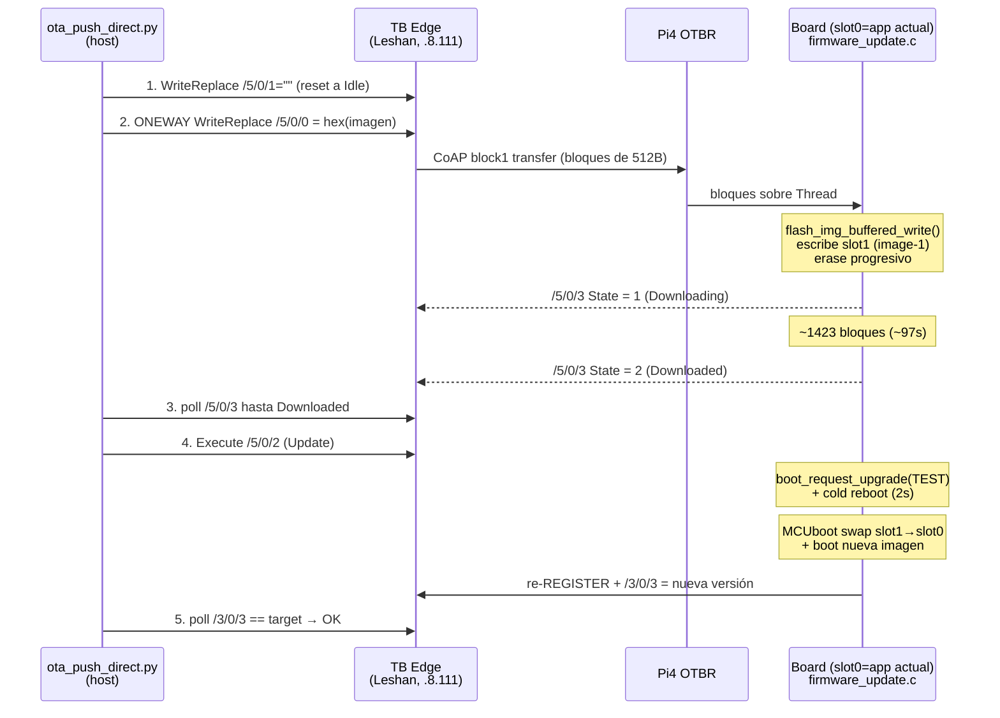

# OTA (Firmware Over-The-Air) — análisis completo

> Cómo funciona, cuánto demora (datos reales), limitaciones y operación.
> Es la vía de despliegue **sin USB** — inmune al wedge del USB-Serial-JTAG.

---

## 0. Resumen ejecutivo

| Dato | Valor (medido en Lab1, 2026-06-20) |
|---|---|
| **Tiempo total** | **~3 min** por board (push → confirmado) |
| Imagen | 728 KB (`zephyr.signed.bin`, app firmada slot1) |
| Download (malla) | ~97 s (~7.5 KB/s efectivo, block=512B) |
| Swap + reboot + re-registro | ~69 s |
| USB requerido | **NINGUNO** — todo por Thread |
| Rollback | automático (MCUboot TEST mode) |
| Concurrencia | 1 board a la vez recomendado (carga Edge/malla) |

**Por qué importa:** los SuperMini con USB-Serial-JTAG nativo wedgean al flashear por USB. OTA
los actualiza por la malla sin tocar el cable → la solución definitiva para mantener la flota.

---

## 1. Cómo funciona — arquitectura

OTA usa el **LwM2M Object 5 (Firmware Update)**. La pieza clave: **TB Edge NO orquesta
el OTA** (eso es feature Cloud-only); el Edge solo **proxea** y embebe Leshan. Así que
**empujamos la imagen nosotros** vía RPC de Leshan sobre la conexión ya registrada del board.



### Flujo board-side (`src/firmware_update.c`)
1. **Bloque 0** (`offset==0`): `flash_img_init()` → abre stream a slot1 (image-1).
2. **Cada bloque** (256B buffer interno): `flash_img_buffered_write()` → bufferiza + **erase
   progresivo** de slot1 (`CONFIG_IMG_ERASE_PROGRESSIVELY=y`). PUSH (write /5/0/0) y PULL
   (fetch desde URI) ambos soportados.
3. **Execute /5/0/2**: `boot_request_upgrade(BOOT_UPGRADE_TEST)` → cold reboot a los 2s.
4. **MCUboot** hace swap slot1→slot0 y arranca la nueva imagen.
5. **Confirmación**: la nueva imagen llama `boot_write_img_confirmed()` desde `main()`
   tras el 1er REGISTER exitoso (vía el stable-marker, +600s). Si NO confirma (crashea
   antes de registrar), **MCUboot revierte a la imagen anterior** en el siguiente reset.

---

## 2. Timing real (medido en Lab1 / ami-esp32c6-1494)

```
17:06:35  push aceptado (oneway)          +0.4s   Leshan encola la transferencia
17:06:44  state=1 Downloading             +9s     primer bloque empieza
17:08:21  state=2 Downloaded              +106s   728KB recibidos en slot1 (~97s de transferencia)
17:08:xx  Execute /5/0/2 → reboot
17:09:30  /3/0/3 = "0.7.10-led"           +175s   nueva imagen booteada + re-registrada
─────────────────────────────────────────────────
TOTAL: ~3 minutos (push → versión confirmada)
```

**Desglose:**
- **Transferencia (~97s):** 728KB / 512B = ~1423 bloques CoAP block1 sobre Thread. ~7.5 KB/s
  efectivo (incluye overhead CoAP CON/ACK + latencia malla + Leshan).
- **Swap + reboot + re-registro (~69s):** MCUboot swap (~10-20s) + boot-stagger (0-30s
  aleatorio) + Thread attach (~3-5s) + DNS-SD + REGISTER jitter (0-30s) + REGISTER.

**Escalado:** secuencial, ~3 min/board → **6 wedged ≈ 18 min**, **30 boards ≈ 90 min**.
El cuello de botella es la transferencia (malla) + el re-registro escalonado.

---

## 3. Limitaciones

1. **Requiere el board ONLINE y registrado.** OTA va por la conexión LwM2M existente. Un
   board stuck/silencioso NO se puede OTA-ear (hay que recuperarlo primero — power-cycle/USB).
   Los wedged-pero-vivos (Lab1,2,3,7,9,13) SÍ son alcanzables.
2. **TB Edge no orquesta** — hay que empujar con `ota_push_direct.py` (Leshan RPC). La FOTA
   nativa de TB es Cloud-only.
3. **1 board a la vez** (recomendado). El push de 728KB satura Edge+malla; OTA-ear 30 en
   paralelo arriesga congestión + la inanición de address-resolution del OTBR.
4. **Tamaño de imagen ≤ slot1.** El layout MCUboot (4MB): mcuboot@0x0, slot0@0x20000.
   slot1 (image-1) debe ser ≥ la imagen. 728KB entra holgado (slots ~1.9MB).
5. **Solo actualiza la APP (slot1), NO mcuboot.** El bootloader no se OTA-ea. Para cambiar
   mcuboot hace falta USB (rara vez necesario).
6. **Block size = trade-off** (`CONFIG_LWM2M_COAP_BLOCK_SIZE`): 512 (prj.conf, balanceado),
   1024 (ota.conf/aggr — más rápido pero ráfagas RX mayores), 64 (brn_fix — anti-brownout,
   lento). Más grande = download más rápido pero más estrés de malla/energía.
7. **Ventana de transferencia frágil ante drop de malla.** Si el board detacha a mitad del
   download, la transferencia falla y hay que reintentar (el estado vuelve a Idle).
8. **MCUboot swap usa scratch/move** — añade ~10-20s y desgasta flash (un ciclo erase de
   slot1 por OTA). No es para OTA-ear cada minuto.
9. **`LWM2M_TIMEOUT` alto necesario** — el push oneway usa `timeout_ms=600000` (10 min) para
   no morir en el async-RPC de Tomcat con payloads grandes. ONEWAY evita el timeout de ~30s
   del two-way RPC.

---

## 4. Seguridad / rollback (MCUboot)

- **TEST mode**: `boot_request_upgrade(BOOT_UPGRADE_TEST)` marca slot1 como "probar una vez".
- Si la nueva imagen **bootea + registra** → `boot_write_img_confirmed()` la fija permanente.
- Si **crashea/no registra** antes de confirmar → MCUboot **revierte** a la imagen previa en
  el próximo reset. **Rollback automático gratis.**
- Esto hace OTA **seguro**: una imagen mala no brickea — el board vuelve solo a la anterior.
- La imagen va **firmada** (`zephyr.signed.bin`, clave MCUboot) — MCUboot rechaza imágenes
  sin firma válida.

---

## 5. Guía operativa

**Pre-requisito:** build con la app firmada. La app OTA = `<build>/ami-lwm2m-node/zephyr/zephyr.signed.bin`
(NO mcuboot). El board destino debe estar **activo en TB**.

### Un board
```powershell
$PY="C:\Users\jsgir\Documents\ESP32\.venv\Scripts\python.exe"
$BIN="C:\Users\jsgir\Documents\ESP32\zephyrproject\build_audit\ami-lwm2m-node\zephyr\zephyr.signed.bin"
& $PY tools/ota_push_direct.py --device ami-esp32c6-1494 --version 0.7.10-led --bin $BIN
# --no-execute : pushea a slot1 pero NO rebootea (stage para aplicar después)
# --dl-timeout 400 : max segundos de download
```

### Fleet
```powershell
& $PY tools/ota_fleet.py ...    # OTA secuencial a varios (ver --help)
```

### Verificar
```powershell
& $PY tools/fleet_audit.py      # confirma fw_version por board
```

**Estado /5/0/3:** 0=Idle · 1=Downloading · 2=Downloaded · 3=Updating.
**Resultado /5/0/5:** 0=inicial · 1=success · otros=error.

---

## 6. Troubleshooting

| Síntoma | Causa / fix |
|---|---|
| `state returned to Idle` durante download | board detachó / bloque perdido → reintentar |
| `device not found` | el endpoint no está registrado en TB → verificar activo |
| download nunca llega a Downloaded | malla congestionada o block size muy grande → bajar `--dl-timeout` / reintentar |
| board no reporta la versión nueva tras Execute | MCUboot revirtió (la imagen no registró) → revisar que el build sea sano |
| OTA muy lento (>5 min) | block size 64, o malla con RSSI bajo / muchos hops |

---

## 7. Conclusión

OTA es **la herramienta definitiva** para la flota: actualiza cualquier board **vivo en la
malla** en **~3 min sin USB**, con **rollback automático**. Elimina por completo la pelea
contra el wedge USB para mantenimiento de firmware. La única restricción real es que el board
debe estar **online** — un board muerto necesita recuperación física primero, pero un
wedged-pero-vivo (el caso de Lab1,2,3,7,9,13) se actualiza por OTA sin problema.

**Estrategia recomendada:** USB solo para el **primer flasheo** (o boards muertos); todo el
mantenimiento posterior **por OTA**.
